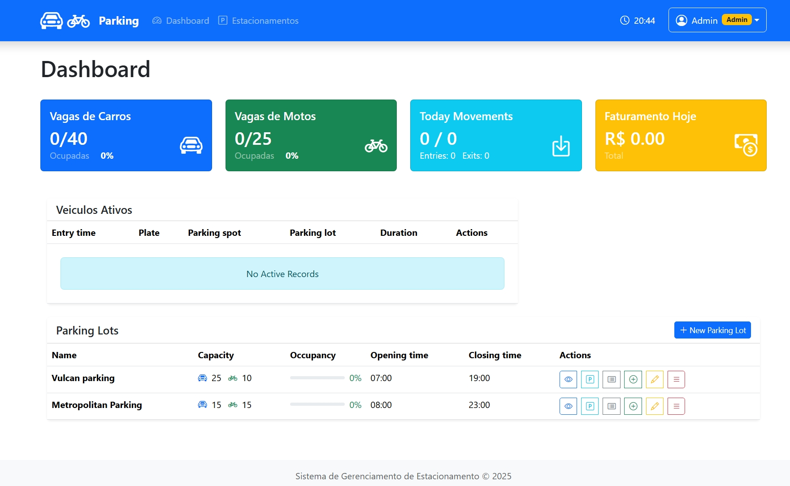
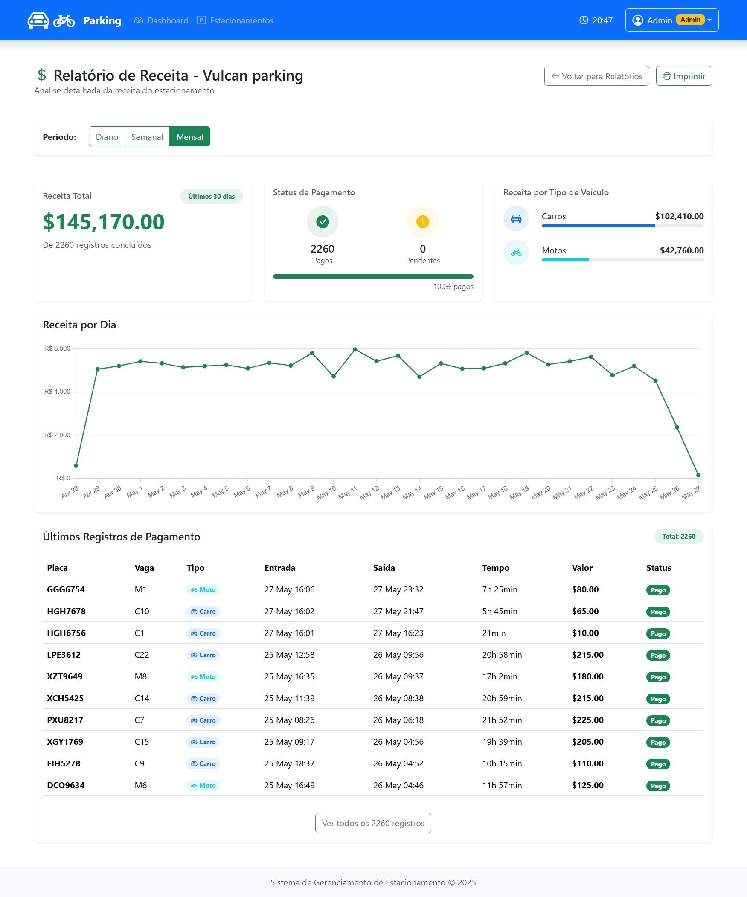
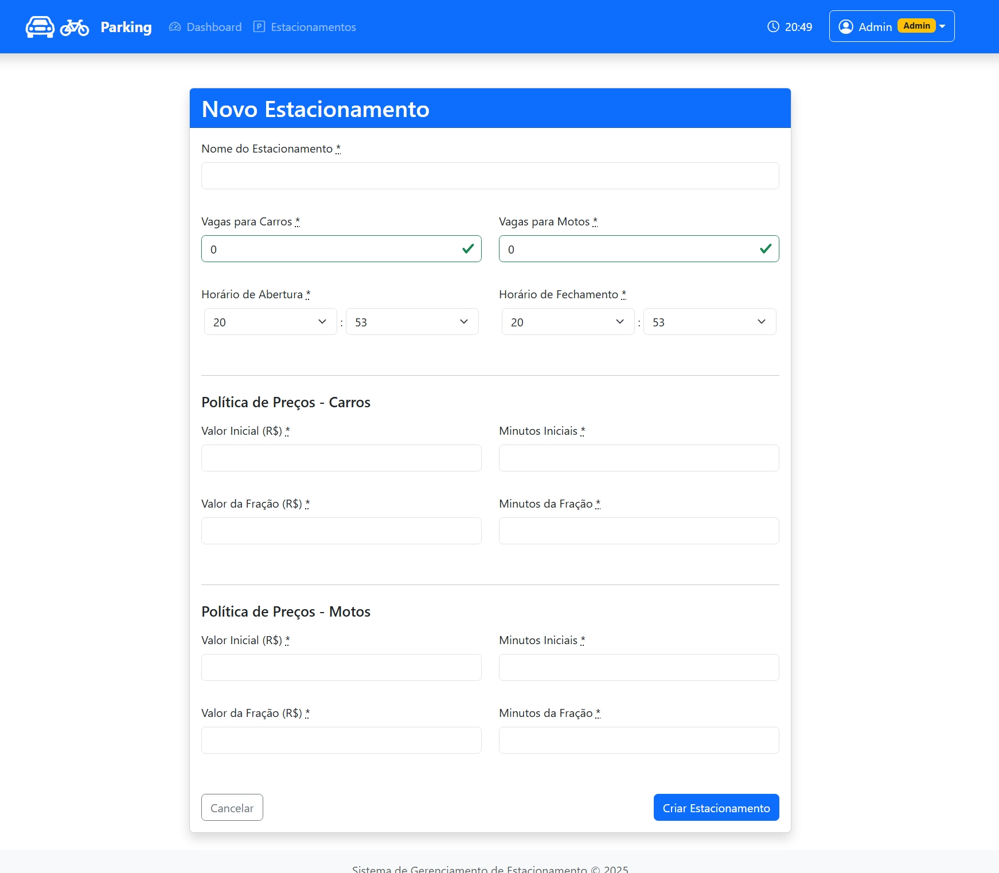
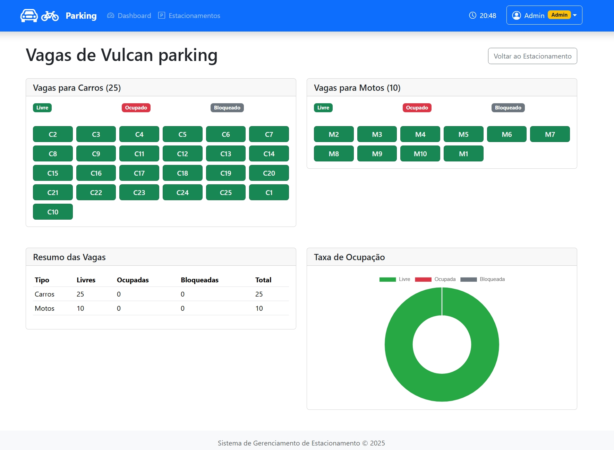
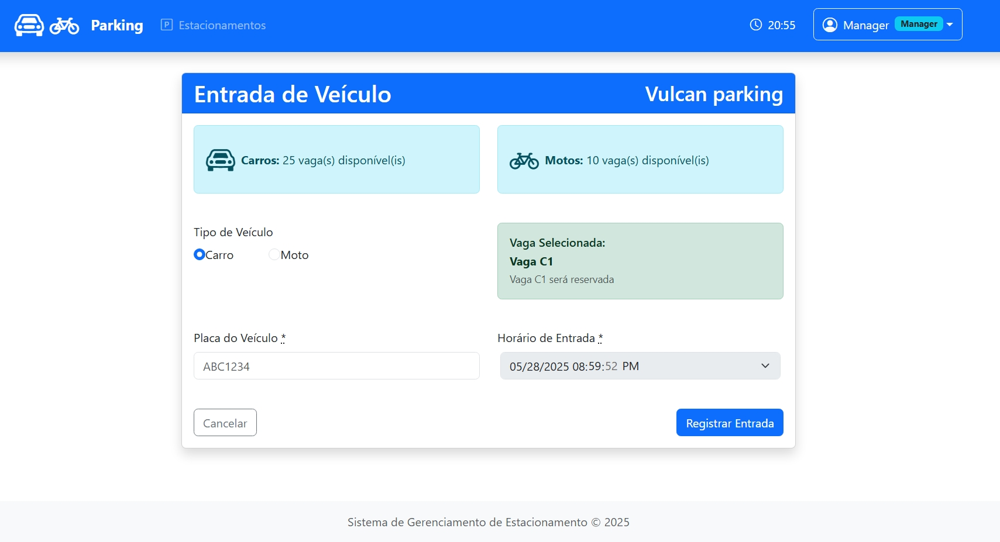
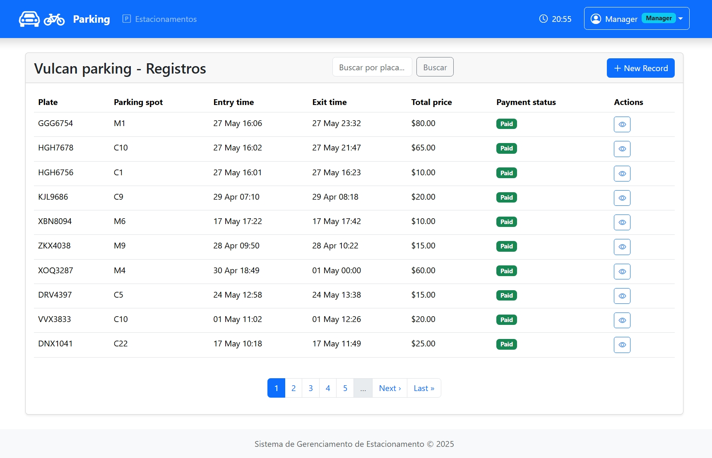

# Sistema de Gerenciamento de Estacionamento

Um sistema completo para gerenciamento de estacionamentos desenvolvido com Ruby on Rails 7, utilizando tecnologias como Hotwire e Stimulus para uma experiência de usuário fluida e interativa.

## 📋 Índice

- [Sobre o Projeto](#sobre-o-projeto)
- [Tecnologias Utilizadas](#tecnologias-utilizadas)
- [Funcionalidades](#funcionalidades)
- [Instalação](#instalação)
- [Configuração](#configuração)
- [Uso](#uso)
- [Estrutura do Banco de Dados](#estrutura-do-banco-de-dados)
- [Segurança](#segurança)
- [Licença](#licença)

## 🚗 Sobre o Projeto

O Sistema de Gerenciamento de Estacionamento é uma aplicação web robusta e escalável que permite o controle completo de operações de estacionamento, incluindo:

- Gestão de vagas para carros e motocicletas
- Controle de entrada e saída de veículos
- Cálculo automático de tarifas
- Relatórios financeiros e operacionais
- Interface administrativa intuitiva
- Atualizações em tempo real via Hotwire

## 🛠 Tecnologias Utilizadas

### Backend

- **Ruby** 3.3+
- **Ruby on Rails** 7.0+
- **PostgreSQL** (banco de dados principal)

### Frontend

- **Hotwire** (Turbo + Stimulus)
- **Stimulus.js** (para interatividade)
- **Bootstrap CSS** (estilização)
- **Turbo Frames & Streams** (atualizações em tempo real)

## ✨ Funcionalidades

### 🏢 Gestão Administrativa

- **CRUD de Estacionamentos**: Criação, edição e visualização de estacionamentos
- **Configuração de Vagas**: Definição automática de vagas por tipo (carro/moto)
- **Controle de Preços**: Configuração de tarifas por hora por tipo de veículo
- **Horários de Funcionamento**: Definição de horários de abertura e fechamento

### 🚙 Controle de Veículos

- **Entrada de Veículos**: Registro rápido com validação de placa e tipo
- **Saída de Veículos**: Processo de saída com cálculo automático de tarifa
- **Validação de Placas**: Verificação de formato e duplicatas
- **Alocação Inteligente**: Distribuição automatizada de vagas disponíveis

### 📊 Relatórios e Dashboard

- **Dashboard em Tempo Real**: Visualização de vagas ocupadas/livres
- **Relatórios Diários**: Resumo de movimentação e faturamento
- **Histórico Completo**: Registro de todas as operações
- **Estatísticas**: Métricas de ocupação e receita

### 🔄 Funcionalidades em Tempo Real

- **Atualização Automática**: Status de vagas atualizado instantaneamente
- **Notificações**: Alertas para vagas esgotadas ou problemas

## Algumas Views

. Home Index


. Dashboard


. Relaroeio de Finanças


. Cria Estacionamento


. Detalhes das Vagas


. Registra Entrada


. Lista Entradas


## 🚀 Instalação

### Pré-requisitos

- Ruby 3.3 ou superior
- Rails 7.2 ou superior
- PostgreSQL 13+
- Node.js 18+ (para assets)

### Passos da Instalação

1.  **Clone o repositório**

    ```bash
    git clone https://github.com/vulcanobr/parking-manager.git
    cd parking-manager
    ```

2.  **Instale as dependências Ruby**

    OBS: Gems instaladas

           gem "bootstrap", "~> 5.3.3"
           gem "simple_form"
           gem "kaminari"
           gem "bootstrap5-kaminari-views"
           gem "chartkick"
           gem "groupdate"
           gem "enum_help"
           gem "pundit"
           gem "dotenv-rails"
           gem "tty-spinner"

    ```bash
    bundle install
    ```

3.  **Instale as dependências JavaScript**

    ```bash
    yarn install
    ```

## ⚙️ Configuração

### Variáveis de Ambiente

Crie um arquivo `.env` na raiz do projeto:

```env
DB_HOST= localhost
DB_USERNAME= postgres
DB_PASSWORD= password do banco

DEFAULT_PASSWORD= 123456
```

### Configuração do Banco

```yaml
# config/database.yml
development:
  adapter: postgresql
  host: <%= ENV['DB_HOST'] %>
  username: <%= ENV['DB_USERNAME'] %>
  password: <%= ENV['DB_PASSWORD'] %>
  port: 5432
```

**Criar o banco de dados e tabelas **

    ```bash
    rails db:create
    rails db:migrate
    rails db:seed
    ```

## 💻 Uso

### Acesso ao Sistema

**Inicie os serviços**

    ```bash
    # Terminal 1 - Rails server
    rails server

    ```

- **URL de Desenvolvimento**: `http://localhost:3000`
- Admin
  - email : admin@parking.com
  - password : admin123
- Manager
  -email : manager@parking.com
  - passworg : manager123

### Fluxo Básico de Operação

1. **Configurar um Estacionamento**

   - Acesse a área como admin
   - Crie um novo estacionamento definindo vagas e preços
   - O sistema gerará automaticamente as vagas

2. **Registrar Entrada de Veículo**

   - Informe a placa e tipo do veículo
   - O sistema alocará automaticamente uma vaga disponível
   - Confirmação será exibida em tempo real

3. **Registrar Saída de Veículo**

   - Digite a placa do veículo
   - Visualize o valor calculado
   - Confirme o pagamento e saída

4. **Visualizar Relatórios**
   - Acesse a área como admin
   - Acesse a seção de relatórios
   - Filtre por data e estacionamento
   - Exporte dados se necessário

## 🗄 Estrutura do Banco de Dados

### ParkingLot (Estacionamentos)

| Campo                       | Tipo    | Descrição                   |
| --------------------------- | ------- | --------------------------- |
| name                        | string  | Nome do estacionamento      |
| total_car_spots             | integer | Total de vagas para carros  |
| total_motorcycle_spots      | integer | Total de vagas para motos   |
| open_time                   | time    | Horário de abertura         |
| close_time                  | time    | Horário de fechamento       |
| initial_price_car           | decimal | Preço inicial para carros   |
| initial_minutes_car         | integer | minutos inicial para carros |
| fraction_price_car          | decimal | Preço/fração minutos carros |
| fraction_minutes_car        | integer | Minutos/fração para carros  |
| motorcycle_price_per_hour   | decimal | Preço/hora para motos       |
| initial_price_motorcycle    | decimal | Preço inicial para motos    |
| initial_minutes_motorcycle  | integer | minutos inicial para motos  |
| fraction_price_motorcycle   | decimal | Preço/fração minutos motos  |
| fraction_minutes_motorcicle | integer | Minutos/fração para motos   |

### Spot (Vagas)

| Campo          | Tipo    | Descrição                           |
| -------------- | ------- | ----------------------------------- |
| parking_lot_id | integer | FK para ParkingLot                  |
| identifier     | string  | Código da vaga (ex: C01, M12)       |
| vehicle_type   | enum    | Tipo: car, motorcycle               |
| status         | enum    | Status: free, occupied, unavailable |

### ParkingRecord (Registros)

| Campo          | Tipo     | Descrição               |
| -------------- | -------- | ----------------------- |
| parking_lot_id | integer  | FK para ParkingLot      |
| spot_id        | integer  | FK para Spot            |
| vehicle_plate  | string   | Placa do veículo        |
| vehicle_type   | enum     | Tipo do veículo         |
| entry_time     | datetime | Data/hora de entrada    |
| exit_time      | datetime | Data/hora de saída      |
| total_price    | decimal  | Valor total a pagar     |
| total_time     | integer  | total horas permanencia |
| status         | string   | "pending", "paid"       |

### Criar base de dados(popula tabelas)

    Principais características:
    1. Estacionamento Vulcan Parking:

    25 vagas para carros, 10 para motos
    Horário: 07:00 às 19:00
    Preços configurados conforme especificado

    2. Vagas criadas automaticamente:

    Carros: C1, C2, C3... até C25
    Motos: M1, M2, M3... até M10

    3. 3000 registros de estacionamento com:

    Período de 30 dias (data atual -1 até 30 dias atrás)
    Placas no formato correto (3 letras + 4 números)
    Horários respeitando abertura/fechamento
    Verificação de conflitos de vagas
    Cálculo automático de preço e tempo
    Status sempre "paid"

    4. Validações implementadas:

    Data de entrada não maior que atual
    Hora de entrada dentro do funcionamento
    Data de saída não menor que entrada
    Duração mínima de 10 minutos
    Máximo 2 dias de permanência
    Verificação de disponibilidade das vagas

    5. Recursos adicionais:

    Sistema de retry para conflitos
    Relatório de progresso durante execução
    Estatísticas finais detalhadas
    Cálculos de receita por tipo de veículo

    Tasks disponíveis:

    Setup completo:
    ```
    bash

    rails dev:reset_parking # Reset completo (drop, create, migrate + setup)

    Tasks individuais:

    bash

    rails dev:setup_parking_lot # Criar apenas o estacionamento
    rails dev:create_parking_spots # Criar apenas as vagas
    rails dev:generate_parking_records # Gerar apenas os registros

    Utilitários:

    bash

    rails dev:parking_stats # Mostrar estatísticas detalhadas
    rails dev:clean_parking # Limpar todos os dados
    ```
    Exemplo de uso:

    ```
    bash

    # Setup completo
    rails dev:setup_parking

    # Ou passo a passo
    rails dev:setup_parking_lot
    rails dev:create_parking_spots
    rails dev:generate_parking_records

    # Ver estatísticas
    rails dev:parking_stats
    ```

## 🔒 Segurança

- **Validação de Entrada**: Sanitização de todos os inputs
- **CSRF Protection**: Proteção contra ataques CSRF
- **SQL Injection**: Uso de Active Record para prevenção

### Padrões de Código

- Siga o [Ruby Style Guide](https://rubystyle.guide/)
- Use o [Rails Best Practices](https://rails-bestpractices.com/)
- Documente métodos públicos complexos

## 📄 Licença

Este projeto está sob a licença MIT. Veja o arquivo [LICENSE](LICENSE) para mais detalhes.

## 🆘 Suporte

Para suporte, envie um email para vulcanorjbr@gmail.com ou crie uma issue no GitHub.

⭐ **Se este projeto te ajudou, não esqueça de dar uma estrela!**

**Desenvolvido com ❤️ usando Ruby on Rails 7, Hotwire e Stimulus**
